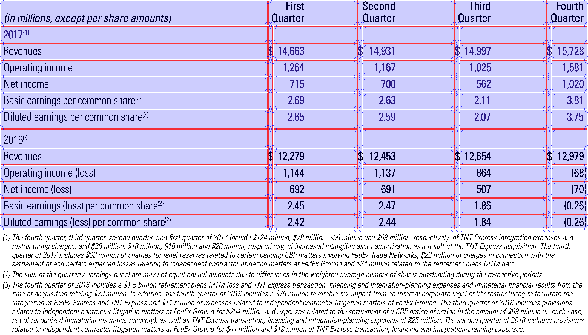

To develop and test the programm the FINTAB dataset is used. To analyse and extract certain objects from the pdfs the pdfplumber python package is used

## Table finding
### Rule-based Approach
#### Getting the table lines
The python package pdfplumber is used for line extraction. Some lines are not detected because they show up as filled rectangles with very little height. Those are also considered

#### Concatenate Lines
The number of lines found in the tables is often higher, than the number of lines visually present in the pdf. The first consideration was that dashed lines are presented with multiple small lines, but instead many long lines are separated into multiple parts, partly representing the size of a column. In the end it didn't help for cell detection because it was very inconsistent. Lines are concatenated based on their distance to the top of the page. The difference on the x-axis is not taken into consideration because, it gives better results for the table finding process per se. Nevertheless the information about the different line segments (x-difference is important) is also stored

#### Getting the bounding box
Each ruling line represents at first a table and is it's anker point. Starting from there, two bounding boxes are created, one above the line and one below. They are open to the top or bottom respectively. The left and right border are represented by two horizontal lines. The distance to the left side of the page is the start or end point of the ruling line.
The next step is to sort the characters in each bounding box by their distance to the top of the page. If the y-difference between two characters is greater than a specified value, a new top or bottom border is found. 
With this new bounding box the same process is repeated for the left and right side. 
The resulting bounding boxes are compared to find overlapping tables. All overlapping tables are merged adjusting the bounding box. Once again the process of extending the bounding box is repeated for each side.

### Model-based Approach
For comparison and better results the yolov8s-table-extraction machine-learning model is used.

## Cell Extraction
### pdfplumber table extraction
Pdfplumber has it's own method for table extraction. Unfortunately the lack of information about the tables lead to no results. The only given information are the ruling lines, which are not really of any help.
It works better with the bounding box found based on the ruling lines. The outline of the table can be defined as explicit horizontal/vertical lines in the table settings. It uses "text" to determine both column and rows. 
But even after tweaking the settings a littel more the table extraction isn't very reliable.

### LayoutExtractor
This is custom approach to get separator lines for columns and rows. These are then used in pdfplumber as explicit lines for cell extraction.
The very basic decision criteria for the separators is the x-distance between to characters for vertical and the y-distance for horizontal lines respectively. For both axis a threshold can be set. the default settings by now are x=5, y=2. Ofcourse there are also some edge cases.

#### Special Symbols (deprecated)
In this example the first and second column are not separated. We can lower the x value but that also creates more separator, that we don't want. So instead another criteria is introduced. The font name, which can be easily retrieved for each character with pdfplumber. When the font changes and the x-distance is greater than 1 we also create a new separator. The minimum x-distance is required. In some tables the first column also has a bold header (changes the font name). Without the minimum x-distance multiple separator lines would be created.

#### Footnotes (deprecated)
Another problem are footnotes. I first thought of completely removing them from the table extraction, but they are important information. So the table needs to be divided into the actual table and the bounding box for the footnotes. That is done in the method for separting row. The first approach was to use the font size to distinguish between the table and the footnotes. But the footnote numbers appear ofcourse also directly in the table as superscripts. I even thought about the transformation matrix of the characters but that was a dead end.
The approach I now use, when I find a change in size I also check if the y-distance is greater than zero. If so it is not a superscript and therefore a potential footnote. If only superscripts are found but no actual footnote. The table finding process is repeated with a greater maximum y-difference.

#### Multi-Header Tables
To improve column extraction in tables with headers consisting of more than one level, the table is divided into multiple horizontal segments. The header is separated from the rest of the table. The header-line, which separates those two, is hereby defined by the first occurrence of a font-change between two characters, when they are sorted from top to bottom. If there is noch such difference the first row-separator is used. The header is now separated into further segments based on ruling lines and found row separators.

#### Average line space
To further improve the row extraction, the line spacing is used. The average line spacing (python: statistics.mode()) and the minimum line spacing (python min()) were compared. In general the minimum line spacing gives better results, but the user will be allowed to change that, as well as to set a custom value.

#### Shrink Cells
Remove dots and spaces and then shrink extracted cells to the minimum bounding box.

#### Page Layout for table width
Increase the table width if the page layout indicates a one column page. At the height of the table mid of the page is scanned for intersecting objects. If they exist a one column page is assumed but at least a table that takes the whole width of the layout.

### Table Object
Dictionary:
    bbox: 
    header: y-coordinate for header-line
    footer: y-coordinate for footer-line
    cells: cells extracted with pdfplumber, shrinked and formated as {bbox: , text:} dictionary pair
    pdfplumber_cells: dictionary containing cells extracted with pdfplumber and the corresponding text
    settings: settings for pdfplumber table extraction

### Cli
