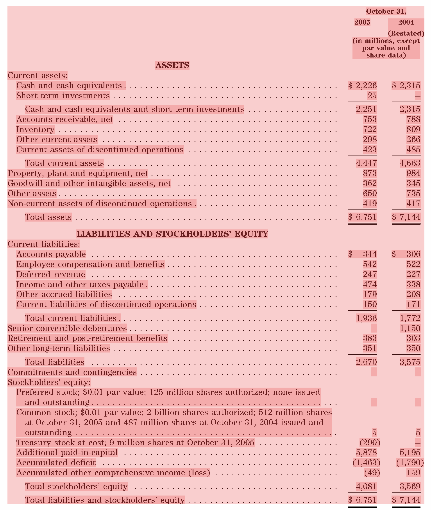
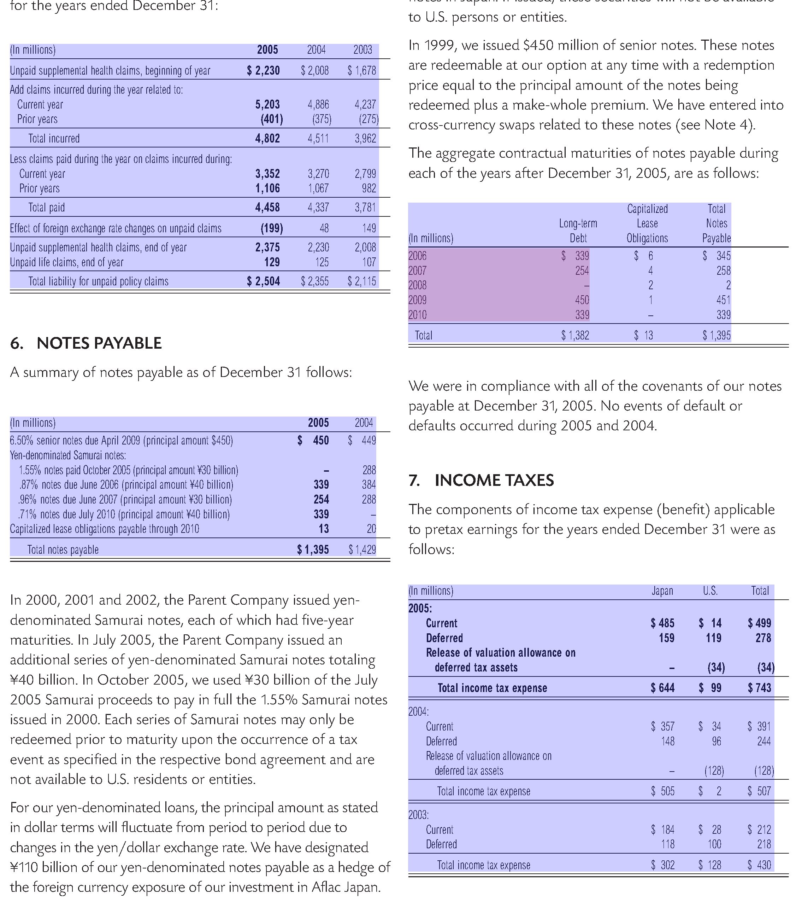
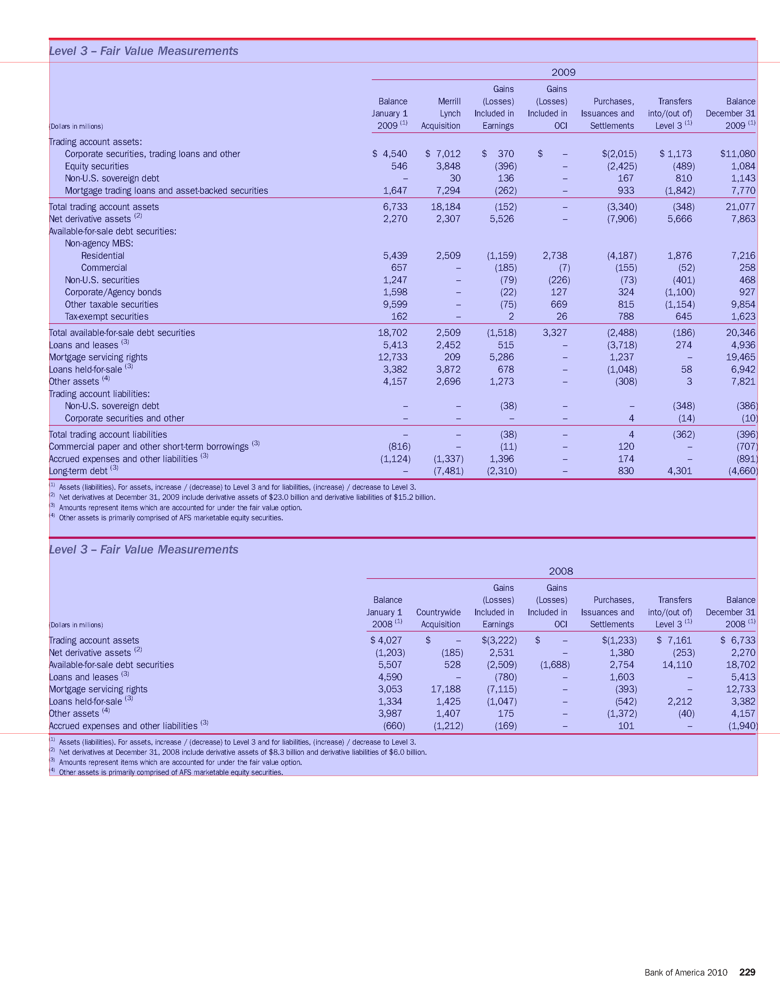

The goal of this internship is to detect tables within pdfs, based on their ruling lines. The table-formatting solely with ruling lines is relatively common in financial reports. 

# 1. Algorithm
The table detection consists of three major steps: the table detection, the layout detection and the table extraction which combines the first and second step. To develop and test the programm the FINTAB dataset is used. To analyse and extract certain objects from the pdfs the pdfplumber python package is used.

## 1.1 Table detection
### Rule-based Approach
#### Getting the table lines
The python package pdfplumber is used for line extraction.

#### Concatenate Lines
The number of lines found in the tables is often higher, than the number of lines visually present in the pdf. The first consideration was that dashed lines are presented with multiple small lines, but instead many long lines are separated into multiple parts, partly representing the size of a column. In the end it didn't help for cell detection because it was very inconsistent. Lines are concatenated based on their distance to the top of the page. The difference on the x-axis is not taken into consideration because, it gives better results for the table finding process per se. Nevertheless the information about the different line segments (x-difference is important) is also stored

#### Lines that aren't lines
Some lines are not detected by pdfplumber because they show up as filled rectangles with very little height. They are also considered for table detection. For some pdfs it was also helpful to consider dot sequences as lines.

#### Getting the bounding box
Each ruling line represents a new table a table and is it's anker point. Starting from there, two bounding boxes are created, one above the line and one below. They are open to the top or bottom respectively. The left and right border are represented by two horizontal lines. The distance to the left side of the page is the start or end point of the ruling line.
The next step is to sort the characters in each bounding box by their distance to the top of the page. If the y-difference between two characters is greater than a specified value, a new top or bottom border is found. 
With this new bounding box the same process is repeated for the left and right side. 
The resulting bounding boxes are compared to find overlapping tables. All overlapping tables are merged adjusting the bounding box. Once again the process of extending the bounding box is repeated for each side.

#### Page Layout
If it is detected, that the page has a single column layout, the threshold for the left and right is ignored and instead the most left and right characters are used as border for the table. Characters that are rotated, which can be obtained with their matrix that pdfplumber provides, are ignored. The following picture shows an example that demonstrates the necessity. The most right character would be one of the characters inside the black box, which would break the layout detection.
A page is considered as one-column page if characters and lines can be found in the middle of the page. Two cases are considered:
    + The object height of each object found within the bounding box (mid, top, mid+3, bottom) is summed up. If this height is greater than 30% of the page height we consider it a one-column layout
    + The bounding box is set to (mid, top of table, mid+3, bottom of table). If any characters or lines are found, the page is also considered a one-column page.

### Model-based Approach
For comparison and better results two different machine-learning models are used. yolov8s-table-extraction and microsoft table-detection. The settings for the microsofts table-detection are slightly altered to recognize more tables with the cost of a little more inacuracy. The default threshold value is 0.9, but with that a lot of tables aren't detected. With a threshold value of 0.5 a lot more tables are detected but they sometimes have to wide boundaries, especially to the top and bottom. However this can be compensated within the table layout detection. Overall Microsofts model gives better results. Both approaches are implemented within the table detection class and the user can choose what method should be used. The image data both models need can also be accessed via pdfplumber.

Microsofts table detection was trained on the [PubTables dataset](https://www.microsoft.com/en-us/research/publication/pubtables-1m/), that would explain that the table-detection rate isn't so much higher than the custom approach. However their also exists a version that is trained on fintabnet, unfortunately the weights aren't published.

## 1.2. Layout detection
### pdfplumber table extraction
Pdfplumber has it's own method for table extraction, with options to specify explicit lines. Unfortunately the lack of information about the tables lead to no results. The ruling lines doesn't really help, but the results are better when the bounding box from the first step ist used. To detect the layout it uses the distance between words and characters for both column and row detection. But even after tweaking the settings a littel more the table extraction isn't very reliable.

### LayoutExtractor Class
This is a custom approach to detect the table layout. In the end it comes down to finding rows and columns. The separators for these rows/columns are then used as explicit lines for pdfplumber's table extraction.
The very basic decision criteria for the separators is the x-distance between to characters for vertical and the y-distance for horizontal lines respectively. For both axis a threshold can be set. The default settings are x=5, y=2. Unfortunately there are also a ton of edge cases.

#### Average line space
To improve the separation of different rows, the maximum line spacing from which a new row is created, is calculated based on the text in the pdf rather than a default value. Line spacing is calculated as the y-distance between 2 characters. By skipping negative values, characters one the same text line are ignored. The average line spacing can be calculated with the mode() function of the statistics library, however it turned out, that the minimum line spacing (staticstics.min()) gives overall better results. The user can change this and also set a custom value.

#### Special Symbols (deprecated)
In this example the first and second column are not separated. We can lower the x value but that also creates more separator, that we don't want. So instead another criteria is introduced. The font name, which can be easily retrieved for each character with pdfplumber. When the font changes and the x-distance is greater than 3 we also create a new separator. The minimum x-distance as second dependency is required. In some tables the first column also has a bold header (changes the font name). Without the minimum x-distance multiple separator lines would be created.

#### Footnotes (and text-lines that should be excluded)
Footnotes below the actual table are another problem to consider. Not so much with the machine learning models but with the custom approach for table detection. However the models also suffer from text-lines that should't belong to the table.
Footnotes are recognized as such, if they meet the following requirements:
    + The line in the table consists of 2 cells
    + the first cell contains a number, a number in brackets, or a number followed by a dot
    + the first cell is not wider than 10% of the table
The search for footnotes start from the bottom and ends with the first line that isn't a footnote.
Other lines that should't be part of the table are lines with no vertical divider (only one cell), that beginn within the first 10% of the table width. They are removed both above and below the table

#### Header
Unfortunately the ruling lines are rather useless for consistent header extraction. 
The header separator, is set to be the first occurrence of a font-change between two characters, assuming they are sorted from top to bottom. If there is no font change within 90% of the tables height, the ruling line with the greates width is used.

#### Column separation with header line
To correctly recognize multi header tables, the header is divided into multiple horizontal segments according to the rows; the rest of the table (body) is also added as one segment. Each segment is independently scanned for columns.

## 1.3 Table Extraction

### Remove Cells
Remove cells that have either only one cell, one column or one row.

### Merge cells
#### Rows with only one cell

#### Cells containing only dollar symbol

### Shrink Cells
Remove dots and spaces and then shrink extracted cells to the minimum bounding box.

# Testing and Evaluation
The test_fintab.py script evaluates if the tables being detected in a pdf correspond to the tables in the fintabnet dataset. Both the custom table detection and microsofts table detection were tested. The dataset can be downloaded from <https://developer.ibm.com/exchanges/data/all/fintabnet/>.  
For every detected table a similar table in fintabnet is looked for (threshold 30). That means, the summed up differences of each side are required to be less than 30. If that's the case, the table cells are compared. To check whether two cells match is tested with the SequenceMatcher class (difflib library). If the matching ratio is greater than 0.9, they are considered similar enough. With all cells compared, the precision, recall and f1 score are calculated for the table. If the f1 score is greater than 0.7 the cell structure is considered equal enough. The choosen values have turned out to be a good compromise. For comparison the following images shows what would be considered incorrect if we want a perfect table.

It also has to be considered that the annotated tables in fintabnet are not always correct. The following image might be an extreme example but it wasn't the only one with missing table annotations.

It is important to know that the cells aren't always correctly or consistently annotated in the dataset (personal observations). Sometimes cells consist of multiple text-lines which does make sense but sometimes they are split into multiple cells but would make sense to merge them.

Comparison between the custom approach and the microsofts table detection model. Both use the same batch of the first 10000 tables sorted alphabetically by their filename.

Metric | Custom table detection | % | Microsoft table detection | %
---|---|---|---|---
Number of tables found | 12503/10000 | - | 11000/10000 | - 
Precision (Number of matches / Number of found tables) | 6792/12503 | 54.32 %| 6844/11000 | 62.22 %
Recall (Number of matches / Number of expected tables) | 6792/10000 | 67.92 %| 6844/10000 | 68.44 %
F1-Score | 0.6 | - | 0.65 | -
Cell Precision (Number of tables with correct cells / Number of found Tables) | 6189/12503 | 49.5 %  | 6215/11000 | 56.5 %
Cell Recall (Number of tables with correct cells / Number of expected tables) | 6189/10000 | 61.89 % | 6215/10000 | 62.15 %
Cell F1-Score | 0.55 | - | 0.59 | -
Number of tables with correct cells / Number of correct tables | 6189/6792 | 91.12 % | 6215/6844 | 90.81 %
Time spent | 18:41 minutes * | - | 143:26 minutes ** | -   

\* with parallelization: 10 workers with maximum of 20 tasks until new worker is spawned

\** no cuda-capable gpu -> calculations on the cpu

# Outlook
## Header

## Problems
### False positive
#### Lines

### Table Object
Dictionary:
    bbox: 
    header: y-coordinate for header-line
    footer: y-coordinate for footer-line
    cells: cells extracted with pdfplumber, shrinked and formated as {bbox: , text:} dictionary pair
    pdfplumber_cells: dictionary containing cells extracted with pdfplumber and the corresponding text
    settings: settings for pdfplumber table extraction

### Cli

