# Internship: Table detection with ruling lines

Name: Max Tiedl

Matriculation Number: 4187550

Semester: 7

Advisor: Nicolas Reuter

# Table of Contents

1. [Introduction](#introduction)
2. [Tasks](#tasks)
    1. [Table detection (table_finder.py)](#table-detection-table_finderpy)
        1. [Rule-based Approach](#rule-based-approach)
            1. [Concatenate Lines](#concatenate-lines)
            2. [Special lines](#special-lines)
            3. [Getting the bounding box](#getting-the-bounding-box)
            4. [Page Layout](#page-layout)
        2. [Model-based Approach](#model-based-approach)
    2. [Layout detection (layout_extractor.py)](#layout-detection-layout_extractorpy)
        1. [pdfplumber table extraction](#pdfplumber-table-extraction)
        2. [Custom approach](#custom-approach)
            1. [Average line spacing (deprecated)](#average-line-spacing-deprecated)
            2. [Footnotes (and continuous text)](#footnotes-and-continuous-text)
            3. [Header](#header)
            4. [Column separation with header line](#column-separation-with-header-line)
        3. [Font change](#font-change)
        4. [Currency & Special Symbols](#currency--special-symbols)
    3. [Table Extraction (table_extractor.py)](#table-extraction-table_extractorpy)
        1. [Remove Cells](#remove-cells)
        2. [Merge cells](#merge-cells)
            1. [Cells in the body](#cells-in-the-body)
            2. [Cells in the header](#cells-in-the-header)
        3. [Shrink Cells](#shrink-cells)
        4. [Table layout](#table-layout)
        5. [Export](#export)
3. [Cli](#cli)
4. [Testing and Evaluation](#testing-and-evaluation)
5. [Problems](#problems)
    1. [Fintabnet](#fintabnet)
    2. [Table detection](#table-detection)
    3. [Layout detection](#layout-detection)
6. [Conclusion & Outlook](#conclusion--outlook)

# Introduction
The goal of this internship is to detect tables within PDFs, based on their ruling lines. The table-formatting solely with ruling lines is relatively common in financial reports. The method is rule-based and therefore gives more control over the output. Rules can be easily implemented, and the results can be easily understood. Nevertheless, not every edge case can be covered.

| 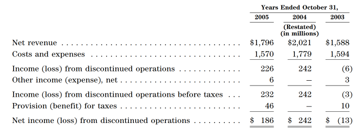 | 
|:--:| 
| *Example of a table with ruling lines* |

# Tasks
The problem is divided into three major steps: the table detection, the layout detection and the table extraction, which combines the first and second step and involves some post-processing. To develop and test the program, the [Fintabnet dataset](https://dax-cdn.cdn.appdomain.cloud/dax-fintabnet/1.0.0/data_preview/index.html) is used. To analyze and extract certain objects (chars, lines, etc.) from the PDFs, the python package [pdfplumber](https://github.com/jsvine/pdfplumber) is used.

## Table detection (table_finder.py)
### Rule-based Approach
The rule-based approach uses the lines found in the PDF for the table detection. All horizontal lines are extracted with [pdfplumber](https://github.com/jsvine/pdfplumber) and vertical lines are ignored.

#### Concatenate Lines
The number of lines found in the tables is often higher, than the number of lines visually present in the PDF. The first consideration was that dashed lines are represented with multiple small lines, but instead many long lines are separated into multiple parts for no obvious reason.  
The lines are concatenated based on their distance to the top of the page. The difference on the x-axis is not taken into consideration, because it gives better results for the table detection per se. Nevertheless, the information about the different line segments, where the x-difference matters is also stored.

#### Special lines
Some lines are not detected by pdfplumber because they show up as filled rectangles with very little height. They are also considered for table and layout detection.  
For some PDFs, it was also helpful to consider sequences of dots as lines. They are only used for the table detection, not for the layout detection.

| 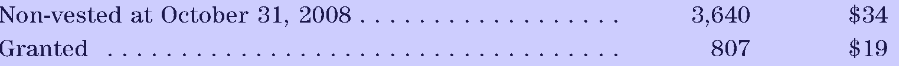 | 
|:--:| 
| *Sequence of dots* |

#### Getting the bounding box
Each line is considered a new table. Starting from a line, two bounding boxes are created, one above the line and one below. They are open to the top or bottom respectively. The left and right border are the start and end point of the ruling line.
The next step is to sort the characters in each bounding box by their distance to the top of the page. If the y-difference between two characters is greater than the threshold, a new top or bottom border is set.  
The process is repeated for the left and right side. The previous found boundaries are used as top and bottom boundary.  
Starting with this bounding box, the process is repeated until the bounding box does not change anymore.  
If this process is completed for every line, the resulting bounding boxes are compared to find overlapping bounding boxes. All overlapping bounding boxes are merged. How they are merged is determined by their position to each other.

| 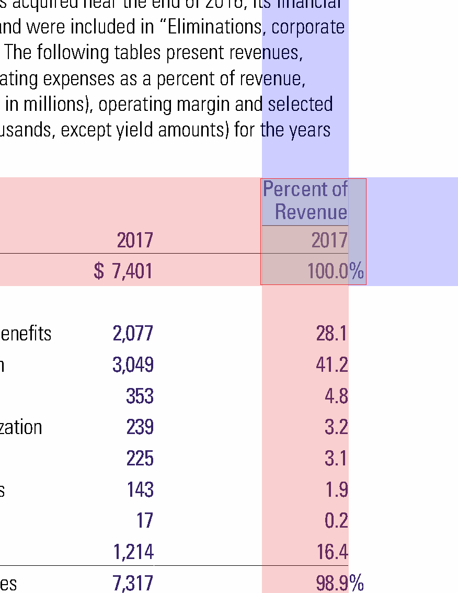 | 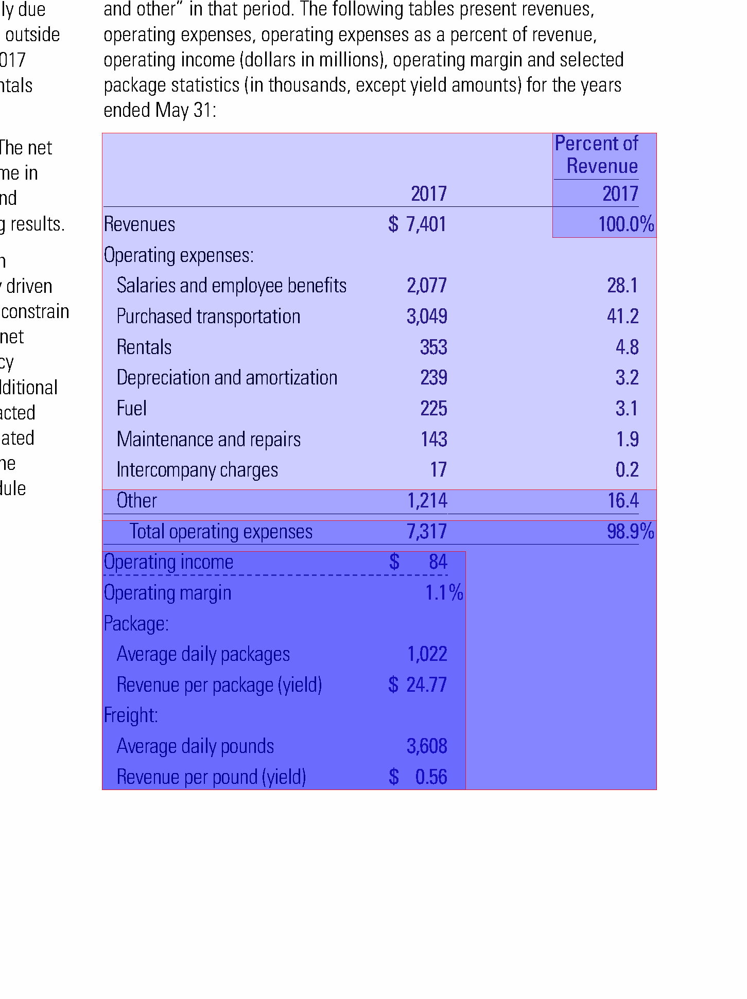 | 
|:--:|:--:|
| *Find the bounding box starting with a ruling line* | *Merging the individual tables, found with ruling lines* |

#### Page Layout
If the page has a single column layout, the threshold for the left and right is ignored and instead the left- and rightmost characters are used as borders for the table. Rotated characters, which can be obtained with their rotation matrix, that pdfplumber provides, are ignored.   
The rotation is important, as the following image shows. The rightmost character would be one of the characters inside the black box. This would lead to a table with an additional column and incorrect rows.  
A page is considered a one-column page if characters and lines can be found in the middle of the page. Two cases are considered:
+ The object height of each object found within the bounding box (mid, top, mid+3, bottom) is summed up. If this height is greater than 30% of the page height, we consider it a one-column layout.
+ The bounding box is set to (mid-1, top of table, mid+1, bottom of table). If any characters or lines are found, the page is also considered a one-column page.

All lines wider than half of the page are also ignored for table detection when a two column layout is detected.

| 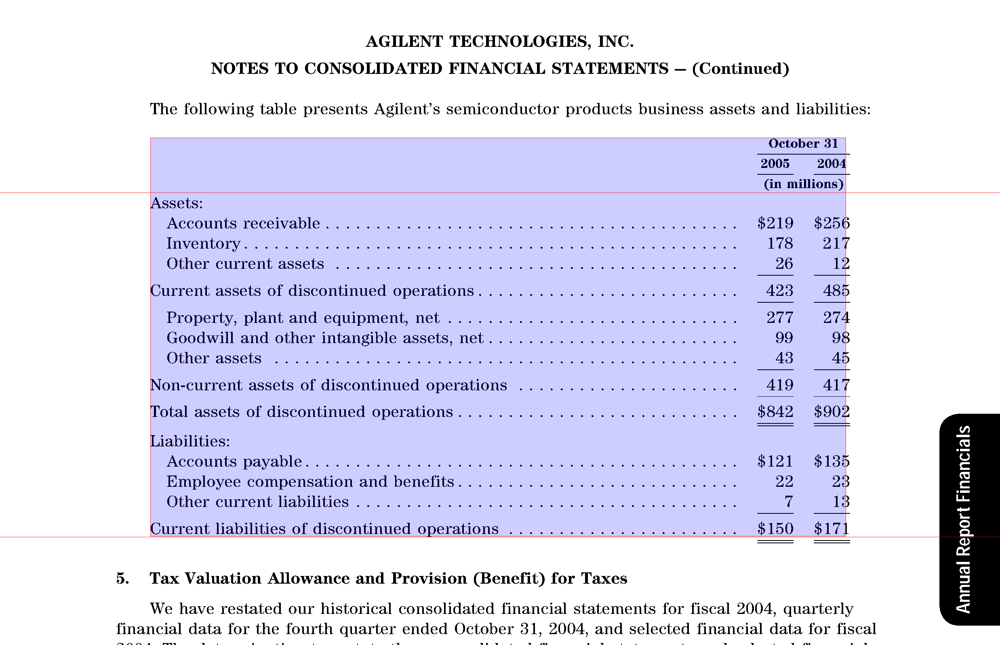 |
|:--:|
| *Find the bounding box starting with a ruling line* |

### Model-based Approach
For comparison and better results, two different machine-learning models are used. [yolov8s-table-extraction](https://huggingface.co/keremberke/yolov8s-table-extraction) and [microsoft-table-detection](https://github.com/microsoft/table-transformer). The settings for Microsoft's table-detection are slightly altered to recognize more tables with the cost of a little more inaccuracy. The default threshold value is 0.9, but with that, a lot of tables are not detected. With a threshold value of 0.5 a lot more tables are detected, but they sometimes have too wide boundaries, especially to the top and bottom. However, this can be compensated within the table layout detection. Overall, Microsoft's model gives better results. Both approaches are implemented within the table detection class, and the user can choose what method should be used. The image data both models need are accessed via pdfplumber.

## Layout detection (layout_extractor.py)
### Pdfplumber table extraction
Pdfplumber has its own method for table extraction with options to specify explicit lines. Unfortunately, the lack of information about the tables (grid) leads to no results. The ruling lines do not really help, but the results are better when the bounding box from the first step is used as approximate location.  
To detect the layout, it can use the distance between words and characters for both column and row detection or horizontal/vertical lines. But even after tweaking the settings, the table extraction is not very reliable. The row detection is good, but columns are often divided into multiple columns.

| 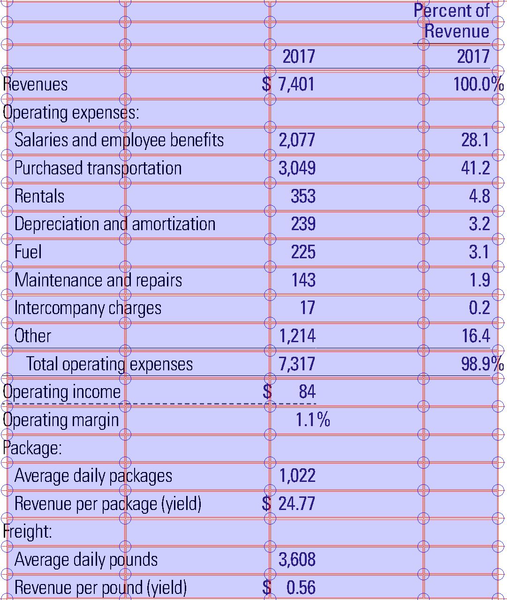 | 
|:--:| 
| *Table extraction with pdfplumber* |

### Custom approach
To have more control over the column/row detection and to implement custom rules, a rule-based approach is introduced. This approach comes down to finding rows and columns. The separators for these rows/columns are used as explicit lines for pdfplumber's table extraction. That means pdfplumber only uses these lines and no other method for layout detection. The method is used to obtain the individual cells and eliminates the need for a custom method.  
The very basic decision criteria for the separators is the x-distance between two characters for vertical and the y-distance for horizontal lines. For both axis a threshold can be set. The default settings are x=5, y=-0.3. The threshold for the row detection has to be slightly negative because some lines overlap a little because of characters like brackets or superscripts.

#### Average line spacing (deprecated)
To improve the separation of different rows, the maximum line spacing, from which a new row is created, is calculated based on the text in the PDF rather than a default value. Line spacing is calculated as the y-distance between 2 characters. By skipping negative values, characters on the same text line are ignored. The average line spacing can be calculated with the mode() function of the statistics library. However, it turned out, that the minimum line spacing (staticstics.min()) gives overall better results.

This method is deprecated: The initial goal here was to distinguish between separate rows and continuous text over multiple rows. This turned out to be impossible only with line spacing.

#### Footnotes (and continuous text)
Footnotes below the actual table are sometimes detected as part of the table. This is a bigger problem for the custom table detection, because there, the detection depends on line spacing, but also exists with the model-based approach. Sometimes footnotes or other text is just too close to the table and is therefore included.  
Footnotes are recognized as such, if they meet the following requirements:
+ The line in the table consists of 2 cells
+ The first cell contains an index number like a number in brackets, or a number followed by a dot
+ The first cell is not wider than 10% of the table

Continuous text is detected by:
+ A line consists of only one cell
+ The cell begins within the first 10% of the table

Both the top and the bottom of the table are searched for continuous text and footnotes. There are, of course, no footnotes at the top, but an indexed heading will also be recognized as a footnote, and should be excluded from the table.

| 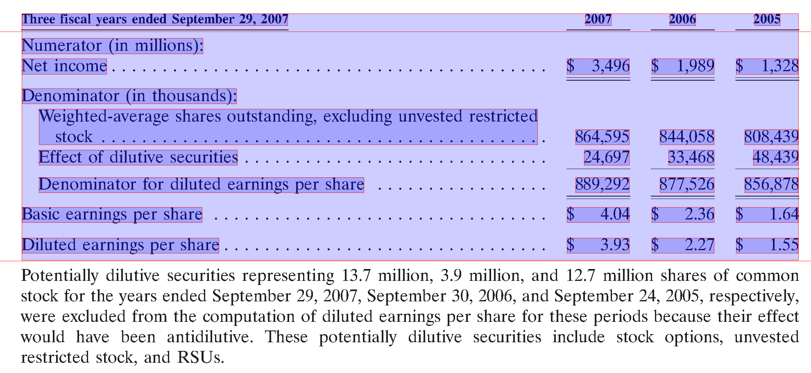 | 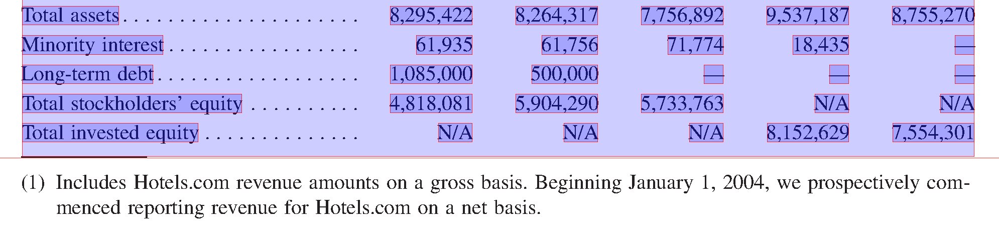 |
|:--:|:--:|
| *Continuous text is ignored* | *Footnotes are ignored* |

#### Header
Unfortunately, the ruling lines are rather useless for consistent header extraction. 
Instead, the header separator, is set to be the first occurrence of a font change between two characters, assuming they are sorted from top to bottom. The font change has to be in the upper part of the table. The upper part is defined as:

$(1-tableHeight)/pageHeight * 0.9$

A font change below this line is not considered. This means that for bigger tables, the font change has to be in a higher part of the table than for smaller tables. 

#### Column separation with header line
The simple approach would be to detect columns for the whole table, but this would not work for tables with one header for multiple columns.

To correctly recognize multi-header tables, the table is divided into multiple horizontal segments. The body (everything except the header) is a segment, and every row in the header is a segment. The column detection is performed for every segment individually. If the character distance is greater than the threshold (default: 5), a column is added.

Every detected column separator is tested to see if it can be extended to the top. For that, a small bounding box that covers the area above the detected column separator is created. If any object (character, ruling line) intersects with this bounding box, the highest not-intersecting point is the new top of the column. If none can be found, the upper boundary of the table is the new top.

| 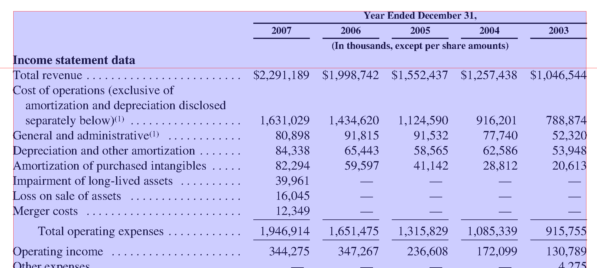 | 
|:--:| 
| *Multi-Header Table* |

### Font change
In the image below, the first two columns are not separated. The threshold can be lowered, but that also creates unintentional separators. Instead, another criteria is introduced. The font name, which can be easily retrieved for each character with pdfplumber. When the font changes and the x-distance is greater than 3, a separator is added. The minimum x-distance as a second dependency is required. In some tables, the first column also has a bold header. Without the minimum x-distance, multiple separator lines would be created.

| 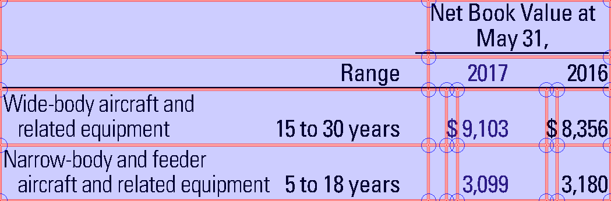 | 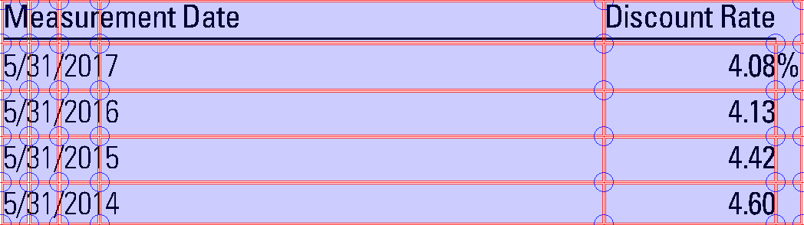 |
|:--:|:--:|
| *Separate column when the font changes* | *A minimum threshold is still important* |

### Currency & Special Symbols
To comply with the fintabnet dataset, currency symbols are not in an extra column. This sometimes is the case when the character spacing is too big. To overcome this issue, between currency symbols and other characters, no column separator is added. Instead, when a currency column is detected, a column separator is inserted before the currency symbol. 

There is also a counterpart for symbols which normally come after a number, such as a percentage sign. Instead of inserting a column between a number and a symbol, it is inserted after the it.

Other special symbols, that are completely ignored for the column detection, are spaces, dots, line breaks and tabs.  
The minus sign is special, because neighter before nor after it, a column is created. Numbers are sometimes given in ranges, so this prevents a column split in these cases.

| 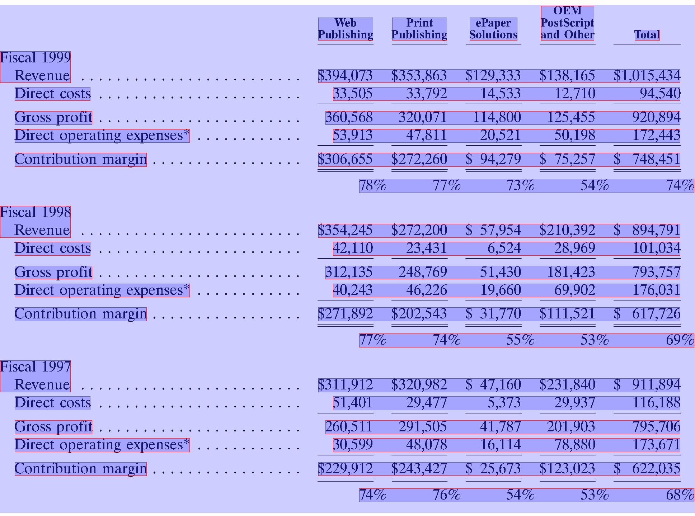 | 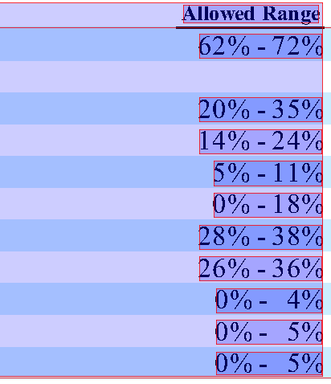 |
|:--:|:--:|
| *Columns cannot be detected because a the percentage sign* | *Minus sign as special symbol* |

## Table Extraction (table_extractor.py)
The table extraction combines the table detection and the layout detection. After that, some post-processing is done (remove cells, merge cells, shrink cells). 
Pdfplumber returns the rows and the cells as different data structures:
+ cells: A list, that contains all the cells, created by the columns and rows
+ rows: A list of rows. Each row contains all the cells and also the potential cells that are added to fulfill the requirement that every row must have the same number of cells. Potential cells have no bounding box and no text.

### Remove Cells
Cells are removed if they either have only one cell, one column or one row.

### Merge cells
#### Cells in the body
Cells in the body are merged with the underlying cell, if:
+ they are the only cell in the row
+ they do not end with a colon or a dot sequence
+ there is no font change between both cells

#### Cells in the header
Underlying rows in the header are merged, when they share the same layout and do not have ruling lines in between. That means, both rows must have the same columns, but they can have empty cells.

### Shrink Cells
Every cell is fitted to the text inside. Spaces and dots are ignored to also remove dot sequences. Both, the original bbox and the new one, as well as the text, are added as a Python dictionary to a list.

### Table layout
The table layout is retrieved using the rows from pdfplumber. If a cell is None, it gets the same text as the previous cell in the rows. This faces the multi-header problem.  
The result is a nested list of strings, which can be used to export the table.

### Export
The table can be exported to json, csv or excel.  
When exporting to json, the whole table dictionary is exported:
+ bbox
+ cells
+ layout
+ header
+ footer
+ pdfplumber settings
+ lines (ruling lines + dot sequences)

To export to csv or excel, the python library [pandas](https://pandas.pydata.org/) is used.  
The table layout is used for the structure. All rows, that belong to the header are merged into a single row. With the table layout, a pandas.DataFrame() can be created and after that exported.

# Command line interface (CLI)
The table extraction can be easily used via the command line. For that, a separate script (cli.py) is used. It can be used with single PDFs or with a folder containing multiple PDFs. By default, the tables are exported to JSON, but this can be changed to CSV or Excel. Also, for better visualization, the table bounding boxes and their cells can be drawn onto the PDF (image). Existing files (images, JSON, CSV, XLSX) with the same name can be overwritten by setting the corresponding argument.  
Other settings:
+ detection_method: The user can choose if the rule-based approach or Microsoft's model should be used for table detection. 
+ layout_method: The user can choose if the rule-based approach or Microsoft's model should be used for table detection. The model-based approach was only used for the evaluation and does not give very good results.
+ max_linespace (only rule-based): If the line space is greater than this value, a new row is created.
+ max_charspace (only rule-based): If the character space is greater than this value, a new column is created
+ workers: By default, the script runs in one process, but can be parallelized. This does only work for the rule-based approach and might not work correctly in the current python version.

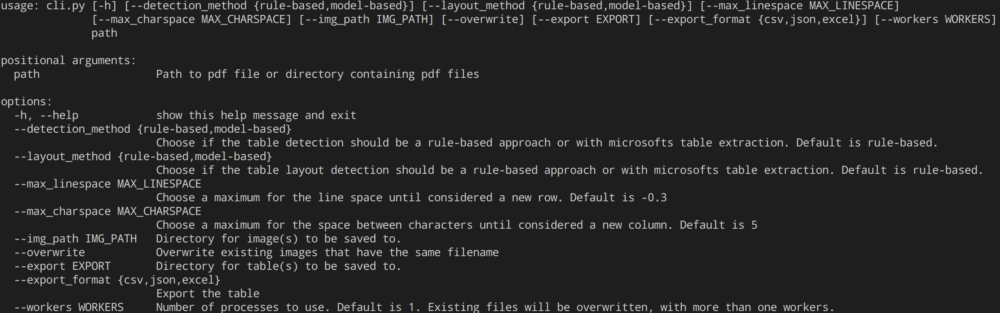

# Testing and Evaluation
The test_fintab.py script evaluates if the tables being detected in a PDF correspond to the tables in the fintabnet dataset. Both the custom table detection and Microsoft's table detection were tested. The dataset can be downloaded from <https://developer.ibm.com/exchanges/data/all/fintabnet/>.  
For every detected table, a similar table in fintabnet is looked for. To check if tables are similar, their overlapping area is checked. This is done via intersecion over union (IOU). Tables are similar if their overlapping area is greater than 0.7.   
In that case, the table cells are compared. Whether two cells match, is decided with the SequenceMatcher class ([python difflib library](https://docs.python.org/3/library/difflib.html)). This class compares two strings for similarity. If the matching ratio is greater than 0.9, they are considered similar enough. This assures, that cells that have small differences like a missing dot, are also considered equal. An alternative would be to test the bounding boxes for overlap, but this does not account for cells where the bounding box is not correctly fitted to the text.  
With all cells compared, the precision, recall and f1 score are calculated for the table cells. If the f1 score is greater than 0.7, the cell structure is considered equal enough. The chosen values have turned out to be a good compromise.

## Comparison

The following table compares the differences between the custom approach and the  results of Microsoft's table detection model. Both use the same batch of the first 10000 tables in fintabnet sorted alphabetically by their filenames.  
The custom approach finds roughly the 10000, where with the model-based approach only 8400 tables are found, but the precision shows, that the model-based approach is much better in detecting the correct tables. Both methods lead to a relative similar F1 score.  
The cell comparison shows a relative similar picture for the custom approach. The model-based layout detection, compared to that, is way worse. Unfortunately the model is not trained on the fintabnet dataset but instead on the [pubtables dataset](https://www.microsoft.com/en-us/research/publication/pubtables-1m/). The results would be better.

Metric | Custom table detection | % | Microsoft table detection with custom layout detection | % | Microsoft table detection + layout detection | % 
---|---|---|---|---|---|---
Number of tables found | 10135/10000 | - | 8366/10000 | - | 8417/10000 | - 
Precision (Number of matches / Number of found tables) | 7876/10135 | 77.71 % | 7093/8366  | 84.78 % | 6961/8417 | 82.7 % 
Recall (Number of matches / Number of expected tables) | 7876/10000 | 78.76 % | 7093/10000 | 70.93 % | 6961/10000 | 69.61 %
F1-Score | 0.782 | - | 0.772 | - | 0.756 | - 
Cell Precision (Number of tables with correct cells / Number of found Tables) | 7152/10135 | 70.57 % | 6290/8366 | 75.19 % | 3372/8417 | 40.06 % 
Cell Recall (Number of tables with correct cells / Number of expected tables) | 7152/10000 | 71.52 % | 6290/10000 | 62.9 % | 3372/10000 | 33.72 %
Cell F1-Score | 0.71 | - | 0.685 | - | 0.366 | -
Mean Cell F1-Score | 0.91 | - | 0.898 | - | 0.653 | - 
Number of tables with correct cells / Number of correct tables | 7152/7876 | 90.81 % | 6290/7093 | 88.68 % | 3372/6961 | 48.44 % 
Time spent | 13:47 minutes * | - | 128:46 minutes ** | - | 159:19 minutes ** | - 

\* with parallelization: 10 workers with maximum of 50 tasks until new worker is spawned

\** no cuda-capable gpu -> calculations on the cpu 

# Problems
## Fintabnet

The dataset is not always correctly annotated, as the following images show. Blue is the table detection with the custom approach, and red is for the annotated tables/cells.

| 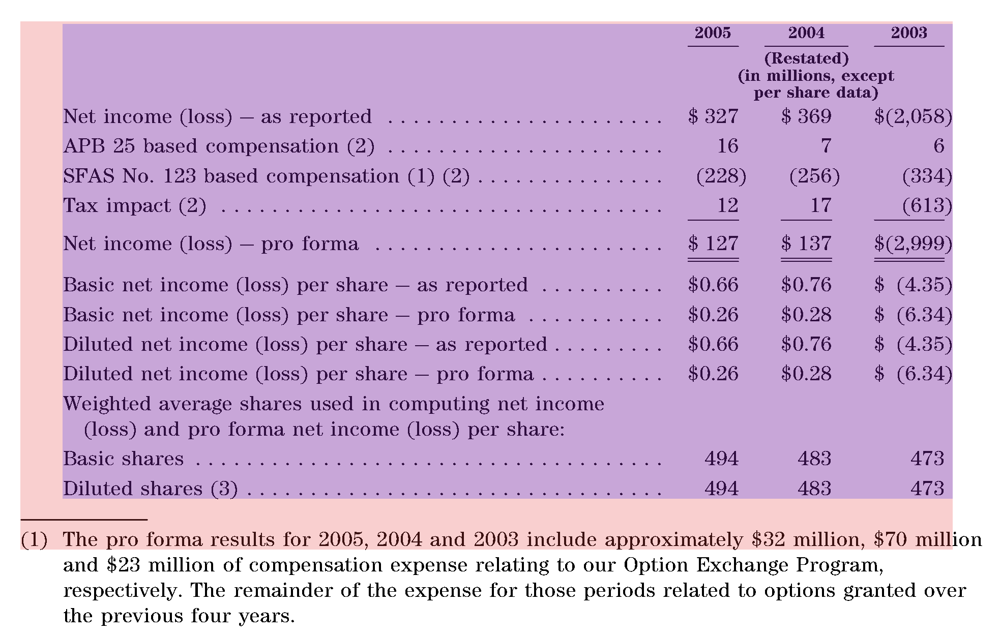 | 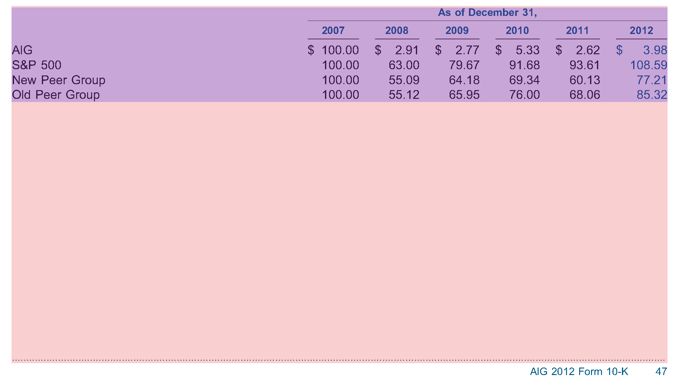 | 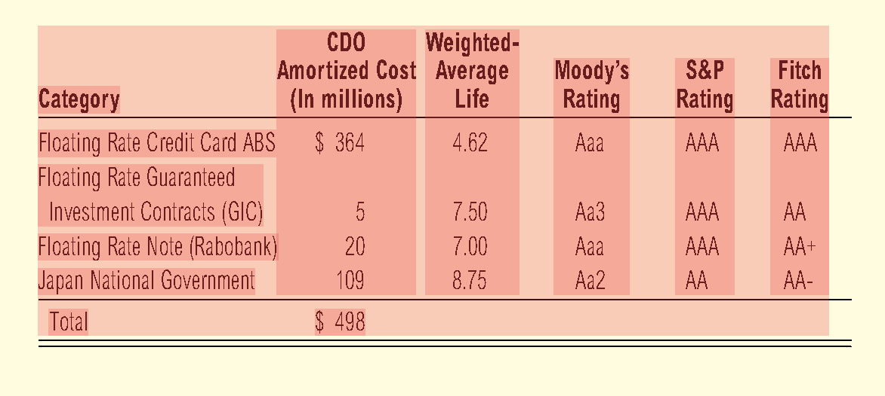 |
|:--:|:--:|:--:|
| *Table is incorrectly annotated* | *Table is incorrectly annotated* | *Cells have incorrect bounding boxes* |

## Table detection
| 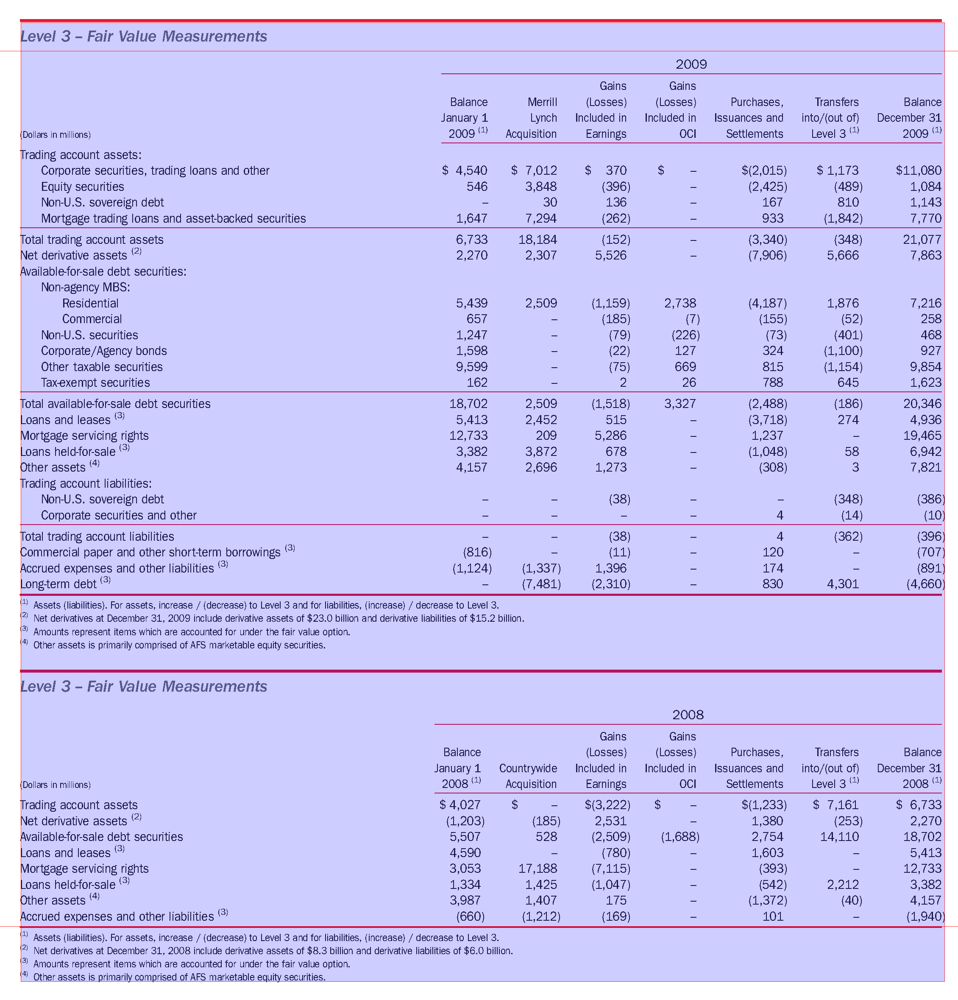 | 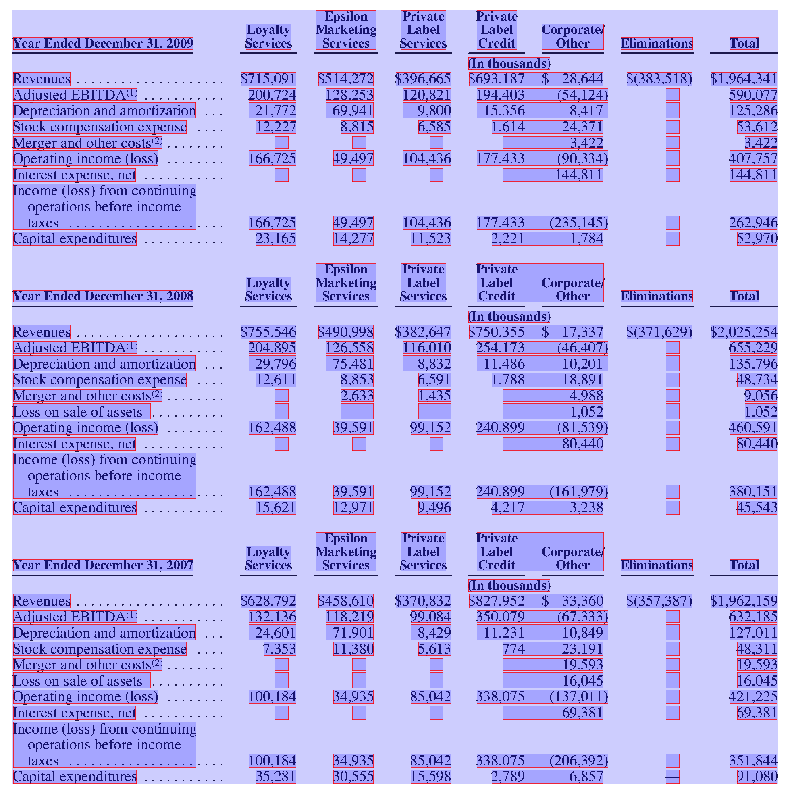 |
|:--:|:--:|
| *Table should be separated* | *Table should be separated* |

| 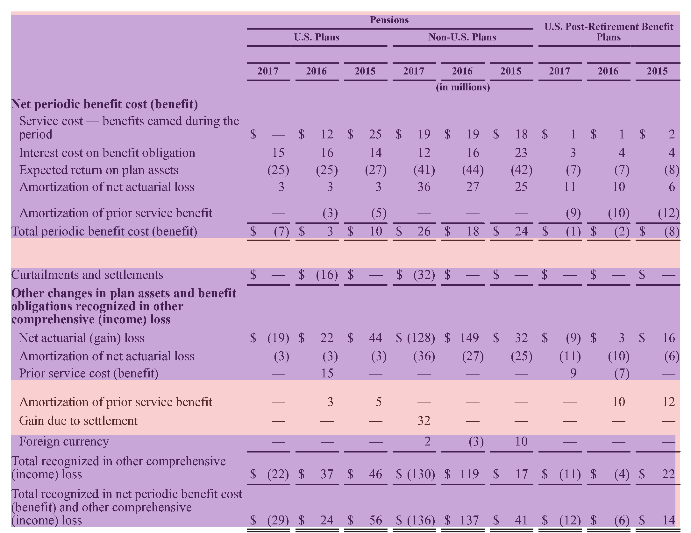 | 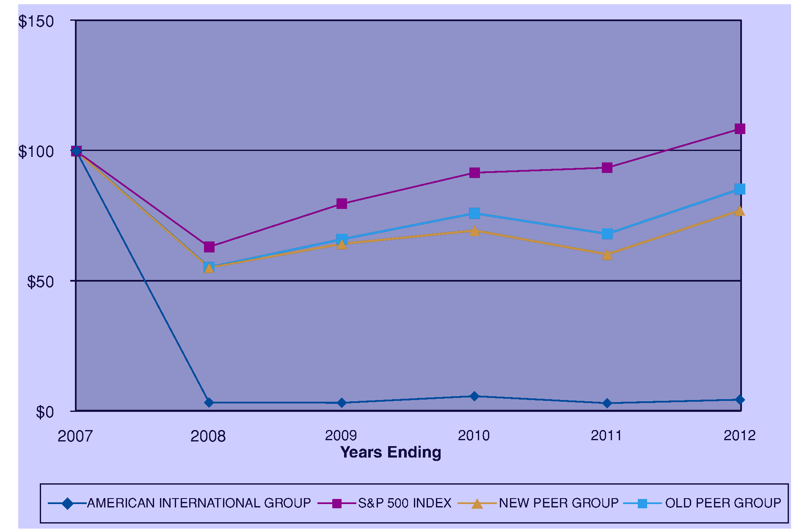 |
|:--:|:--:|
| *Bottom threshold to low* | *Not a table* |

The last image is clearly not a table, but due to the lines that are used in this graphic, it is first detected as one, and because it can also be separated into multiple rows and columns, it is not removed in the table extraction.  
The problem with the other tables is the top/bottom threshold. That can, of course, be solved individually, but would lead to problems with other tables. 

## Layout detection
| 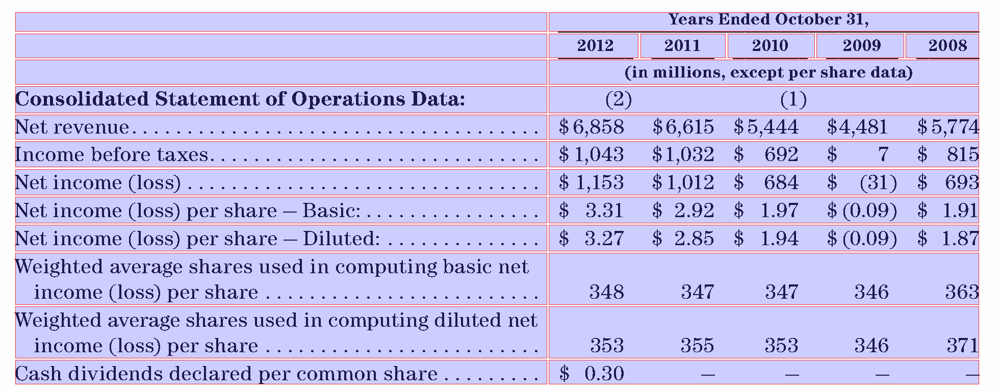 | 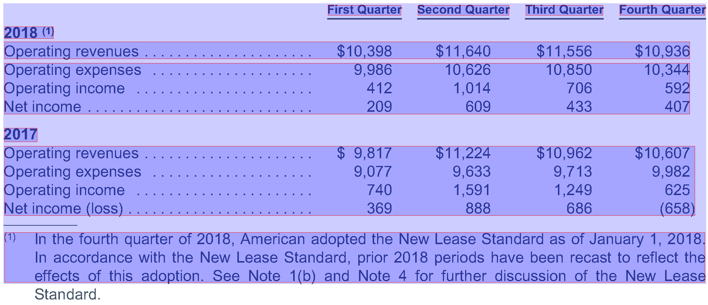 |
|:--:|:--:|
| *The header is not correctly separated* | *The footnote is not correctly separated* |

The first image shows a table, where the header is not correctly separated from the rest of the table. Therefore, the column separation in the body does not work as it should and results in only two columns.  
Similarly, in the second table, the footnote is not correctly separated, and the column separation also does not work.

# Conclusion & Outlook
There will always be some edge case that goes unnoticed or is not important at the moment.
Also when testing the approach with other datasets, which should also be done, new problems will eventually come up.

Interesting for the comparison is also to test a model, that is trained on fintabnet and also to compare the rule-based approach against other rule-based approaches.

The biggest problem with the layout detection turned out to be the separation between header and body. The decision on the basis of the first font change is not perfect, but neither is the decision only with the ruling lines. 

Future layout detection could also include separating not only the header, but also sub headers.

Ideas, that have not yet been implemented:
+ Use the topmost ruling line, that consists of the most segments for header detection 
+ Exclude text sequences in brackets for the column separation &rarr; (in million) or similar annotations.
+ Improve the page layout detection
+ A better top/bottom threshold for table detection, more adapted to the page content