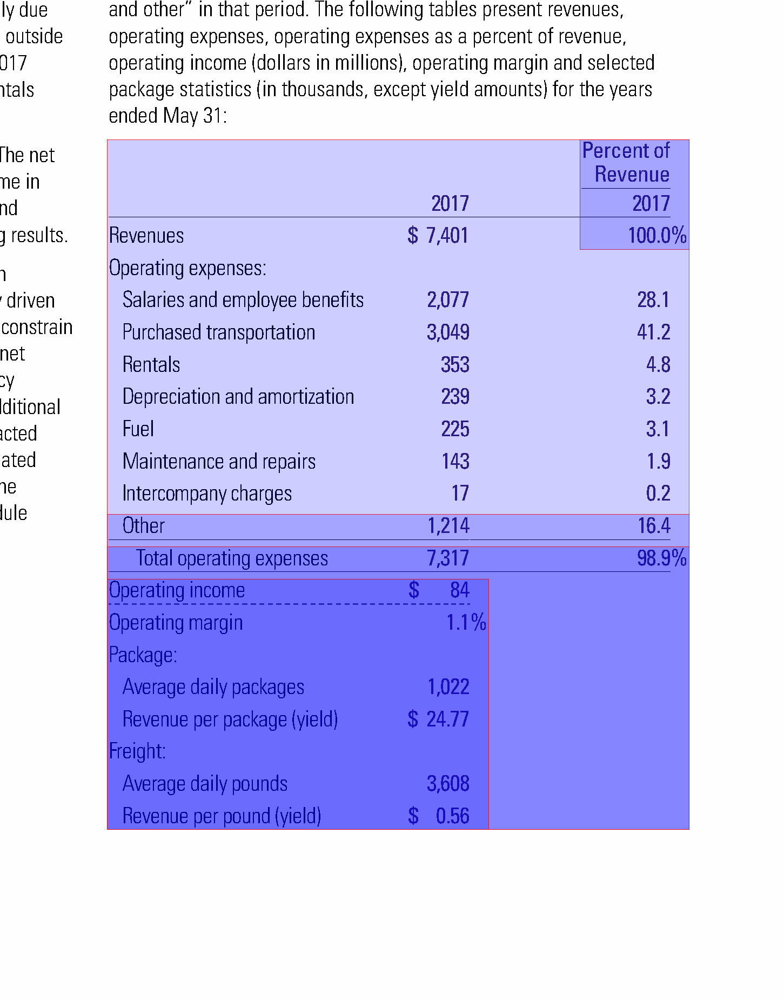

The goal of this internship is to detect tables within pdfs, based on their ruling lines. The table-formatting solely with ruling lines is relatively common in financial reports. 
The table detection consists of three major steps: the table detection, the layout detection and the table extraction which combines the first and second step. To develop and test the programm the FINTAB dataset is used. To analyse and extract certain objects from the pdfs the pdfplumber python package is used.

## Table finding
### Rule-based Approach
#### Getting the table lines
The python package pdfplumber is used for line extraction.

#### Concatenate Lines
The number of lines found in the tables is often higher, than the number of lines visually present in the pdf. The first consideration was that dashed lines are presented with multiple small lines, but instead many long lines are separated into multiple parts, partly representing the size of a column. In the end it didn't help for cell detection because it was very inconsistent. Lines are concatenated based on their distance to the top of the page. The difference on the x-axis is not taken into consideration because, it gives better results for the table finding process per se. Nevertheless the information about the different line segments (x-difference is important) is also stored

#### Lines that aren't lines
Some lines are not detected because they show up as filled rectangles with very little height. Those are also considered as lines. In some pdfs it was also helpful to consider dot sequences as lines.

#### Getting the bounding box
Each ruling line represents at first a table and is it's anker point. Starting from there, two bounding boxes are created, one above the line and one below. They are open to the top or bottom respectively. The left and right border are represented by two horizontal lines. The distance to the left side of the page is the start or end point of the ruling line.
The next step is to sort the characters in each bounding box by their distance to the top of the page. If the y-difference between two characters is greater than a specified value, a new top or bottom border is found. 
With this new bounding box the same process is repeated for the left and right side. 
The resulting bounding boxes are compared to find overlapping tables. All overlapping tables are merged adjusting the bounding box. Once again the process of extending the bounding box is repeated for each side.

### Model-based Approach
For comparison and better results two different machine-learning models are used. yolov8s-table-extraction microsoft table-detection. The settings for the microsofts table-detection are slightly altered to recognize more tables with the cost of a little more inacuracy. The default threshold value is 0.9, but with that a lot of tables aren't detected. The new threshold is 0.7.

## Cell Extraction
### pdfplumber table extraction
Pdfplumber has it's own method for table extraction, with options to specify explicit lines. Unfortunately the lack of information about the tables lead to no results. The ruling lines doesn't really help, but the results are better when the bounding box from the first step ist used. To detect the layout it uses the distance between words and characters for both column and row detection. But even after tweaking the settings a littel more the table extraction isn't very reliable.

### LayoutExtractor
This is custom approach to get separator lines for columns and rows. These are then used in pdfplumber as explicit lines for cell extraction.
The very basic decision criteria for the separators is the x-distance between to characters for vertical and the y-distance for horizontal lines respectively. For both axis a threshold can be set. The default settings are x=5, y=2. Unfortunately there are also a ton of edge cases

#### Special Symbols (deprecated)
In this example the first and second column are not separated. We can lower the x value but that also creates more separator, that we don't want. So instead another criteria is introduced. The font name, which can be easily retrieved for each character with pdfplumber. When the font changes and the x-distance is greater than 3 we also create a new separator. The minimum x-distance as second dependency is required. In some tables the first column also has a bold header (changes the font name). Without the minimum x-distance multiple separator lines would be created.

#### Footnotes (and text-lines that should be excluded)
Footnotes below the actual table are another problem to consider. Not so much with the machine learning models but with the custom approach for table detection. However the models also suffer from text-lines that should't belong to the table.
Footnotes are recognized as such, if they meet the following requirements:
    + The line in the table consists of 2 cells
    + the first cell contains a number, a number in brackets, or a number followed by a dot
    + the first cell is not wider than 10% of the table
The search for footnotes start from the bottom and ends with the first line that isn't a footnote.
Other lines that should't be part of the table are lines with no vertical divider (only one cell), that beginn within the first 10% of the table width. They are removed both above and below the table

#### Header
Unfortunately the ruling lines are rather useless for consistent header extraction. 
The header separator, is set to be the first occurrence of a font-change between two characters, assuming they are sorted from top to bottom. If there is no font change within the first 30% of the tables height, the first ruling line is used. 
To correctly recognize multi header tables, the header is divided into multiple horizontal segments based on the row separators. Each row is independently scanned for 

#### Average line space
To further improve the row extraction, the line spacing is used. The average line spacing (python: statistics.mode()) and the minimum line spacing (python min()) were compared. In general the minimum line spacing gives better results, but the user will be allowed to change that, as well as to set a custom value.

#### Shrink Cells
Remove dots and spaces and then shrink extracted cells to the minimum bounding box.

#### Page Layout for table width
Increase the table width if the page layout indicates a one column page. At the height of the table mid of the page is scanned for intersecting objects. If they exist a one column page is assumed but at least a table that takes the whole width of the layout.

## Problems
### False positive
#### Lines

### Table Object
Dictionary:
    bbox: 
    header: y-coordinate for header-line
    footer: y-coordinate for footer-line
    cells: cells extracted with pdfplumber, shrinked and formated as {bbox: , text:} dictionary pair
    pdfplumber_cells: dictionary containing cells extracted with pdfplumber and the corresponding text
    settings: settings for pdfplumber table extraction

### Cli
